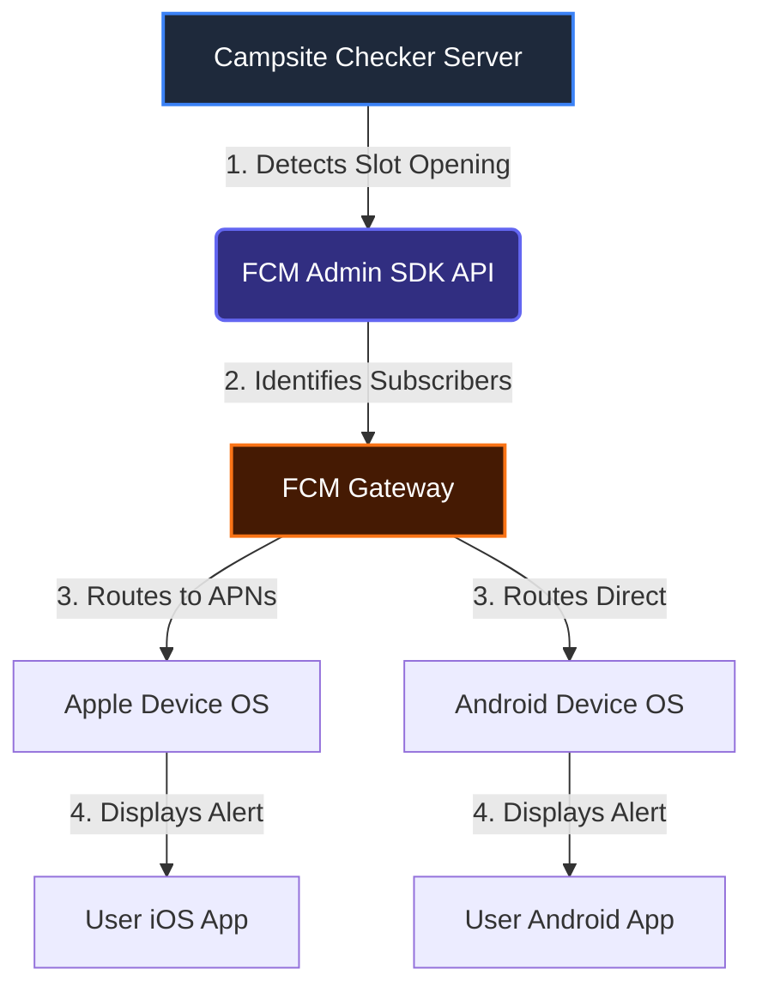

# Native App Transition: Anonymous Push Notifications Architecture

This document outlines the technical design, system integration, and store metadata requirements for implementing anonymous, real-time campsite availability push notifications on native iOS and Android applications.

---

## 1. Core Architecture Overview

To achieve zero battery drain and high user subscription conversion rates, the native apps will use **Firebase Cloud Messaging (FCM)**. FCM acts as the unified dispatcher for Android notifications and wraps Apple's **APNs** for iOS notifications.

We will use **Scenario A (Anonymous Subscriptions)** to minimize user friction (no email/password signup required) and simplify legal privacy declarations.



---

## 2. Topic-Based Subscriptions (FCM Topics)

Each state park campground maps to a unique topic ID: `park-[park_slug]`. Device clients subscribe directly to topics. **No backend database is required to track individual device tokens.**

### iOS Client Integration (Swift)

```swift
import Firebase
import UserNotifications

// 1. Request OS permission (mandatory)
func requestNotificationPermission() {
    UNUserNotificationCenter.current().requestAuthorization(options: [.alert, .sound, .badge]) { granted, error in
        if granted {
            DispatchQueue.main.async {
                UIApplication.shared.registerForRemoteNotifications()
            }
        }
    }
}

// 2. Subscribe to a State Park topic when Bell is toggled
func toggleParkAlert(parkSlug: String, subscribe: Bool) {
    let topicName = "park-\(parkSlug)"
    if subscribe {
        Messaging.messaging().subscribe(toTopic: topicName) { error in
            if let error = error {
                print("Error subscribing: \(error.localizedDescription)")
            } else {
                print("Successfully subscribed to \(topicName)")
            }
        }
    } else {
        Messaging.messaging().unsubscribe(fromTopic: topicName)
    }
}
```

### Android Client Integration (Kotlin)

```kotlin
import com.google.firebase.messaging.FirebaseMessaging
import android.Manifest
import android.content.pm.PackageManager
import androidx.core.content.ContextCompat

// 1. Request Android 13+ POST_NOTIFICATIONS Permission
fun checkNotificationPermission(activity: Activity) {
    if (Build.VERSION.SDK_INT >= Build.VERSION_CODES.TIRAMISU) {
        if (ContextCompat.checkSelfPermission(activity, Manifest.permission.POST_NOTIFICATIONS) != PackageManager.PERMISSION_GRANTED) {
            ActivityCompat.requestPermissions(activity, arrayOf(Manifest.permission.POST_NOTIFICATIONS), 101)
        }
    }
}

// 2. Subscribe/Unsubscribe on Alert Bell toggle
fun toggleParkAlert(parkSlug: String, subscribe: Boolean) {
    val topicName = "park-$parkSlug"
    if (subscribe) {
        FirebaseMessaging.getInstance().subscribeToTopic(topicName)
            .addOnCompleteListener { task ->
                if (task.isSuccessful) {
                    Log.d("FCM", "Successfully subscribed to $topicName")
                }
            }
    } else {
        FirebaseMessaging.getInstance().unsubscribeFromTopic(topicName)
    }
}
```

---

## 3. Server-Side Push Dispatcher (Python Admin SDK)

When your availability checker engine (running in the cloud) identifies that a park's campground has an open slot:

```python
import firebase_admin
from firebase_admin import credentials, messaging

# Initialize the Admin SDK with service account credentials
cred = credentials.Certificate('path/to/firebase-adminsdk-key.json')
firebase_admin.initialize_app(cred)

def send_campsite_alert(park_name, park_slug, available_rv, available_tent):
    topic = f"park-{park_slug}"
    
    # Construct message payload
    message = messaging.Message(
        notification=messaging.Notification(
            title="🏕️ Campsite Opening!",
            body=f"{park_name} has new availability! RV: {available_rv} open, Tent: {available_tent} open."
        ),
        topic=topic,
        # Platforms-specific customization (e.g. sound triggers)
        android=messaging.AndroidConfig(
            priority='high',
            notification=messaging.AndroidNotification(
                sound='default',
                click_action='OPEN_PARK_DRAWER'
            )
        ),
        apns=messaging.APNSConfig(
            payload=messaging.APNSPayload(
                aps=messaging.Aps(
                    sound='default',
                    category='CAMPSITE_ALERT'
                )
            )
        )
    )

    # Broadcast notification to topic subscribers
    response = messaging.send(message)
    print(f"Successfully broadcasted to topic {topic}. Message ID: {response}")
```

---

## 4. App Store & Google Play Compliance Checklist

When publishing the native app to the stores under this anonymous design, complete your privacy listings with these declarations:

### Apple App Store (App Privacy Nutrition Label)
* **Data Collected**: Check **Identifiers -> Device ID**.
* **Link to User Identity?**: Check **No, this data is not linked to the user's identity**.
* **Use/Purpose**: Check **App Functionality** (specifically for sending requested push alerts).

### Google Play Store (Data Safety Section)
* **Data Declared**: Declare collection of **Device or other IDs**.
* **Linked to Identity?**: Declare **No**.
* **Encryption**: Declare that data is **Encrypted in Transit** (HTTPS connection to FCM).
* **Deletion**: Declare that data can be deleted (the user unsubscribes or deletes the app).

---

## 5. Future Stage: "Lazy Login" Integration Roadmap

When you are ready to expand the application to support cross-device alert synchronization (e.g., matching phone alerts to iPad or web dashboard) or email backup:

```mermaid
graph LR
    Anon[1. Anonymous Subscription] -->|Local Storage + Token| Device[Device Specific Alerts]
    Device -->|2. Optional Alert Backup Prompt| SSO[3. One-Tap Quick Login]
    SSO -->|Sign in with Apple / Google SSO| Server[4. Link Token to Secure User ID]
    Server -->|Result| Sync[Cross-Device Sync Active]
    
    style Anon fill:#1e293b,stroke:#94a3b8,color:#fff
    style SSO fill:#1e3a8a,stroke:#3b82f6,color:#fff
    style Sync fill:#064e3b,stroke:#10b981,color:#fff
```



1. **Keep Registration Optional**: Allow users to browse and configure alerts anonymously first.
2. **Add "Sync Alerts" Trigger**: Place a call-to-action button in the alert manager page: *"Access your alerts on all your devices. Back up now."*
3. **Use SSO Providers**: Provide only **Sign in with Apple** (iOS) and **Google Sign-In** (Android). These systems return stable user credentials in 2 seconds using biometric authentication (FaceID/Fingerprint).
4. **Merge Database Records**: On successful SSO, send the device FCM token and user ID to your server. Your server links the existing anonymous records to the permanent account ID.
